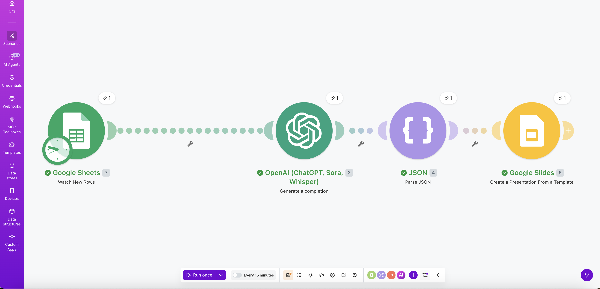

# AI Pitch Deck Generator
### Automated, account-specific sales decks from CRM data — generated in under 90 seconds using Make.com and the OpenAI API

---

## What It Does

This automation generates fully customized sales pitch decks from CRM account data without any manual input from the sales rep. When a new account row is added to a Google Sheet — representing a sales opportunity — Make.com triggers automatically, pulls the account data, sends it to the OpenAI API with a structured prompt, parses the AI-generated content, and populates a branded Google Slides template. The rep receives a finished, account-specific deck with a tailored headline, five insight-led slides with speaker notes, and a closing ask — all generated from the data already captured in the CRM.

---

## The Problem It Solves

Sales reps spend 30–45 minutes manually building a pitch deck before every demo — pulling pain points from their CRM, writing slide content from scratch, and formatting a presentation they could have generated automatically. This is the same work done twice: the rep already entered the account data into the CRM after the discovery call, then copies it manually into a deck. This automation eliminates that second step entirely. The rep advances an opportunity stage in the CRM, and a customized deck is waiting in their Google Drive before they close their laptop.

---

## Architecture Overview

The pipeline runs across five modules in Make.com:
Google Sheets (Watch New Rows)
↓
OpenAI API (GPT-4o mini — structured JSON prompt)
↓
JSON Parse Module (maps AI output to individual variables)
↓
Google Slides (Copy master template)
↓
Google Slides (Replace placeholder text with mapped variables)

**Module 1 — Google Sheets: Watch New Rows**
Monitors a Google Sheet for new account rows. Each row represents a CRM opportunity record containing: Account Name, Industry, Company Size, Pain Points, Business Objectives, Product Tier, and Deal Stage. When a new row is detected, Make.com fires the scenario and passes all field values downstream.

**Module 2 — OpenAI API: Create a Completion**
Make.com assembles a structured prompt using the mapped Google Sheet field values and calls the GPT-4o mini API. The system prompt instructs the model to think like a senior GTM consultant — generating insight-led deck content specific to the account rather than rephrasing the input. The model returns a structured JSON object.

**Module 3 — JSON Parse**
Parses the raw JSON response from the OpenAI API into individually mapped variables: `headline`, `slide_2_body`, `slide_3_body`, `slide_4_body`, `slide_5_body`, `slide_6_body`, and `closing_ask`. Each variable is now available for downstream modules to reference independently.

**Module 4 — Google Slides: Copy a Presentation**
Makes a copy of the master branded slide template in Google Drive, named after the account. This preserves the master template for every future run.

**Module 5 — Google Slides: Replace Text in a Presentation**
Replaces placeholder tags in the copied template — `{{headline}}`, `{{account_name}}`, `{{slide_2_body}}`, etc. — with the corresponding AI-generated values from Module 3. The result is a fully populated, branded presentation saved to a designated Google Drive folder.

---

## The Prompt

The following system prompt is used in Module 2. It is engineered to produce strategic, insight-led deck content rather than generic rephrasing of the input data.
You are a senior GTM Engineer at Relay Financial. Relay is a business banking
platform built specifically for SMB owners — it replaces fragmented multi-bank
setups with a single intelligent platform offering real-time cash flow visibility,
automated payments, physical and virtual cards, and same-day ACH transfers.
Relay's core value proposition is giving business owners and their finance teams
back the time they spend on manual banking admin — and giving leadership real-time
financial visibility they currently don't have.
You are generating a pitch deck for an AE preparing for a demo call. Your job is
to think like a strategic consultant, not a copywriter. Do not rephrase the input
back at the rep. Instead, connect the prospect's specific situation to Relay's
capabilities in a way that makes the business case obvious and urgent.
Rules:

Be specific. Use numbers, timeframes, and business consequences wherever possible.
Never use filler phrases like "tailored solutions", "streamline your operations",
or "drive efficiency."
Every bullet should contain an insight, a consequence, or a specific Relay
capability — not a restatement of the input.
The headline should be provocative and specific to this account — not a
generic tagline.
Format every slide body field with a bullet point character (•) at the start
of each line, with a blank line between each bullet.
The closing ask should be specific to this account's situation, not a generic
"let's meet again."

Account: [Account Name]
Industry: [Industry]
Company Size: [Company Size]
Pain Points: [Pain Points]
Business Objectives: [Business Objectives]
Product Tier: [Product Tier]
Return ONLY valid JSON, no markdown, no explanation, in this exact structure:
{
"headline": "provocative value proposition specific to this account, max 12 words",
"slide_2_body": "3 insight-led bullets about this account's current situation separated by \n\n",
"slide_3_body": "3 bullets connecting their specific pain points to concrete business consequences separated by \n\n",
"slide_4_body": "3 bullets mapping specific features to this account's stated objectives separated by \n\n",
"slide_5_body": "3 bullets quantifying the ROI case with specific numbers and time savings separated by \n\n",
"slide_6_body": "3 bullets outlining a concrete next steps sequence with timeframes separated by \n\n",
"closing_ask": "one specific ask tied to their most urgent pain point and a clear timeframe"
}

---

## Google Slides Template Structure

The master template uses the following placeholder tags which are replaced by Module 5:

| Placeholder | Content |
|---|---|
| `{{account_name}}` | Account name from CRM |
| `{{headline}}` | AI-generated value proposition |
| `{{slide_2_body}}` | Account intelligence bullets |
| `{{slide_3_body}}` | Problem framing bullets |
| `{{slide_4_body}}` | Solution mapping bullets |
| `{{slide_5_body}}` | ROI and business case bullets |
| `{{slide_6_body}}` | Next steps bullets |
| `{{closing_ask}}` | Account-specific closing ask |

---

## Sample Output

The following deck was generated from a single Google Sheet row for a fictional prospect in under 90 seconds.

**Input data:**
- Account: Northland Properties Corp
- Industry: Hospitality & Food Service
- Company Size: 900 employees, BC, Alberta, Ontario
- Pain Points: Multiple business accounts across provinces with no unified cash flow view, high volume of vendor payments processed manually, finance team spending 15+ hours weekly on reconciliation
- Business Objectives: Consolidate business banking, automate vendor payments, give finance leads real-time visibility across entities
- Product Tier: Scale

**Generated headline:**
*"One Platform to End Northland's Multi-Province Banking Fragmentation"*

---

## Production Architecture

This prototype uses a Google Sheet as the data source because it was built without access to a live Salesforce environment. In production, the Google Sheet is replaced by a **Salesforce Flow** record-triggered automation. When an AE advances an opportunity to **Demo Booked** stage, Salesforce Flow detects the stage change and fires an HTTP callout to the Make.com webhook URL — stored securely in a Salesforce Named Credential — passing the opportunity and account fields as a JSON payload. Make.com receives the payload exactly as it receives a new Google Sheet row. The rest of the pipeline — OpenAI API call, JSON parsing, Google Slides population, and Drive delivery — is identical. A Slack notification is sent to the rep with a direct link to the generated deck, and the deck URL writes back to a custom field on the Salesforce opportunity record so the file is always accessible from the CRM. Failed API calls retry twice before creating a task on the opportunity record as a fallback — no Salesforce data is ever written to or corrupted in the failure path.

---

## Tech Stack

| Tool | Role |
|---|---|
| Google Sheets | CRM data stand-in (replaced by Salesforce in production) |
| Make.com | Workflow orchestration and automation |
| OpenAI API (GPT-4o mini) | AI content generation |
| Google Slides API | Template population and deck output |
| Google Drive | File storage and delivery |
| Slack (production) | Rep notification with deck link |
| Salesforce Flow (production) | Trigger on opportunity stage change |

---

## Built By

**Harsh Bawa** — GTM Engineer, AI Workflow Automation, Revenue Systems Architecture
[linkedin.com/in/harshbawa33](https://linkedin.com/in/harshbawa33)
